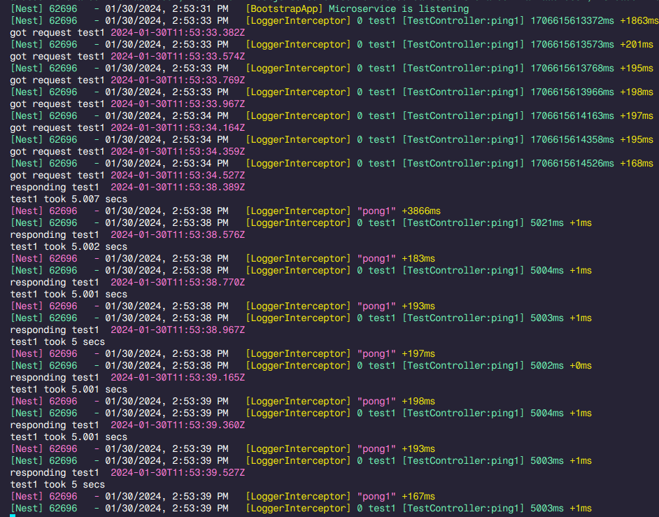

# Kafka one message at the time issue

## Installation and running

1. npm i
2. make .env file with KAFKA_HOST and KAFKA_PORT (defaults are localhost and 9092)
3. npm run start

## Steps to reproduce issue
1. send message to test1 topic (you can use message.kafka file with [VScode extension](https://marketplace.visualstudio.com/items?itemName=jeppeandersen.vscode-kafka))
2. send message to test2 topic

## Expected
messages both received and processed at the same time

## Actual behavior
messages are processed in a row

You can see CPU profile in a root folder (**run.cpuprofile** file)

Flame graphs:

## Comment
Issue occured after updating to nestjs version 10.x
